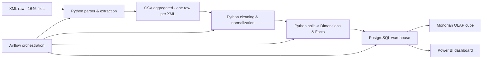
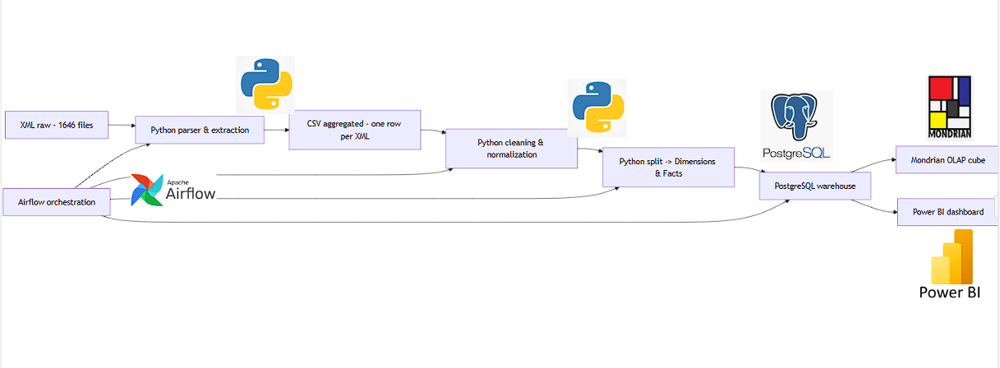
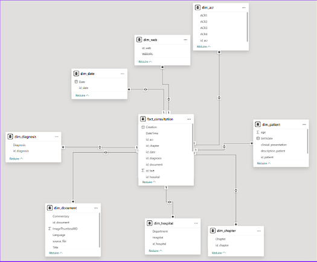
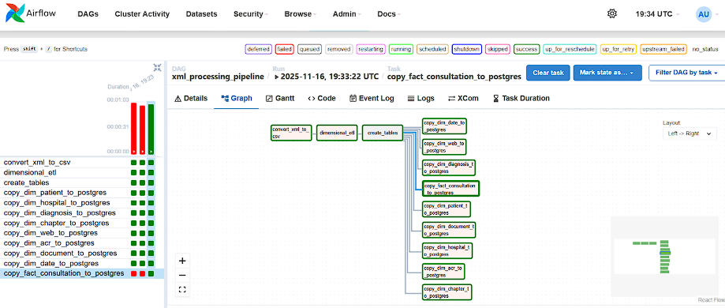

# Projet AI FR Low — Pipeline de données médicales (XML → OLAP)

Résumé
-----
Pipeline de traitement de 1 646 fichiers XML médicaux. Objectif : parser les XML, mesurer la complétude, extraire et transformer les champs en CSV (une ligne = un fichier XML), nettoyer, modéliser en *star schema* (dimensions + faits), charger dans PostgreSQL, et exposer un cube OLAP via Mondrian pour analyses multidimensionnelles. L'orchestration est assurée par Airflow. Les visualisations sont réalisées manuellement avec Power BI.

Architecture (aperçu)
---------------------
Mermaid (GitHub compatible) :

Diagramme ASCII (si Mermaid non disponible) :
XML → Parser Python → CSV agrégé → Nettoyage Python → Split Dimensions/Faits → PostgreSQL → Mondrian OLAP → Power BI (visu)

Pourquoi chaque outil ?
-----------------------
- Python (lxml, pandas, regex, etc.)
  - Parsing fiable des fichiers XML, extraction et transformation flexibles.
  - Génération de CSVs intermédiaires et scripts de nettoyage/feature engineering.
- CSV (format d'échange)
  - Simple, portable, facilite les étapes de validation manuelle et le chargement batch.
- PostgreSQL
  - Stockage robuste et indexable pour dimensions et faits ; scalable pour analyses SQL.
- Airflow
  - Orchestration des tâches : exécution, dépendances, retry, monitoring et planification.
  - Automatise parsing → nettoyage → transformation → chargement.
- Power BI
  - Création de schémas star, exploration visuelle et dashboards (étape manuelle pour storytelling).
- Mondrian (OLAP)
  - Construction d'un cube OLAP pour analyses multidimensionnelles via MDX/MDAX. Permet des agrégations rapides et navigation par dimensions.
- (Optionnel dans le flux) Kubeallap / Kube‑style déploiement
  - Pour déployer des services OLAP et scaler le moteur si besoin (selon implémentation spécifique).

Pipeline — étapes techniques
----------------------------
1. Ingestion
   - Récupérer les 1 646 fichiers XML dans un dossier source.
2. Parsing & Extraction (Python)
   - Extraire champs, mesurer taux de complétude, produire CSV agrégé (1 ligne = 1 XML).
3. Nettoyage (Python)
   - Imputation, suppression/filtrage des nulls, normalisation des formats (dates, codes).
4. Modélisation (Python)
   - Split en fichiers CSV distincts : tables de dimensions + table des faits.
5. Chargement (PostgreSQL)
   - COPY/psycopg2 pour charger en batch, création d'index et contraintes.
6. Orchestration (Airflow)
   - DAGs pour chaque étape, alerting, retries et logging.
7. OLAP (Mondrian)
   - Définir schéma cube, cubes facts + dimensions, exposer via Mondrian pour requêtes MDX.
8. Visualisation (Power BI)
   - Connexion à PostgreSQL ou au cube OLAP pour construire dashboards.

Points clés à mettre en avant dans la présentation
--------------------------------------------------
- Volume et variabilité des XML (1 646 fichiers) : montrer le challenge de l'uniformisation.
- Mesure de complétude : taux remplissage par champ et décisions de nettoyage.
- Valeur du modèle star : optimisation des requêtes analytiques.
- Rôle d'Airflow : reproductibilité et fiabilité du pipeline.
- OLAP vs SQL simple : rapidité des agrégations et navigation multidimensionnelle.
- Limites et améliorations possibles : automatisation totale du dashboard, tests, scaling.

Exemples de commandes utiles
----------------------------
- Lancer un DAG Airflow (cli) :
  - airflow dags trigger <dag_id>
- Charger CSV dans PostgreSQL (psql) :
  - \copy schema.table FROM 'path/file.csv' WITH (FORMAT csv, HEADER true);

Livrables
---------
- Scripts Python :
  - parser_xml.py (extraction + statistiques de complétude)
  - clean_csv.py (nettoyage / imputation)
  - split_star_schema.py (génération dimensions + faits)
  - load_postgres.py (chargement batch)
- DAGs Airflow : orchestration des étapes ci‑dessus
- Fichiers CSV intermediaires et tables PostgreSQL peuplées
- Schéma Mondrian et accès MDX pour analyses

Conseils de présentation (2–3 minutes par slide)
------------------------------------------------
- Slide 1 : Contexte & objectif (problème + jeu de données)
- Slide 2 : Pipeline global (montrer le diagramme)
- Slide 3 : Démonstration rapide (stats de complétude + avant/après nettoyage)
- Slide 4 : Architecture technique & pourquoi chaque outil
- Slide 5 : Résultats & exemple d'analyse MDX
- Slide 6 : Limitations & prochaines étapes

Contact / Notes
---------------
- Ce README est un support synthétique pour votre présentation. Adapter les exemples de commandes et noms de scripts aux fichiers réels de votre repo.
- Pour le schéma visuel, utiliser le rendu Mermaid sur GitHub/PowerPoint ou exporter une image du diagramme.

workflow :

  

star schema : 

  

Airflow orchestration : 

  
